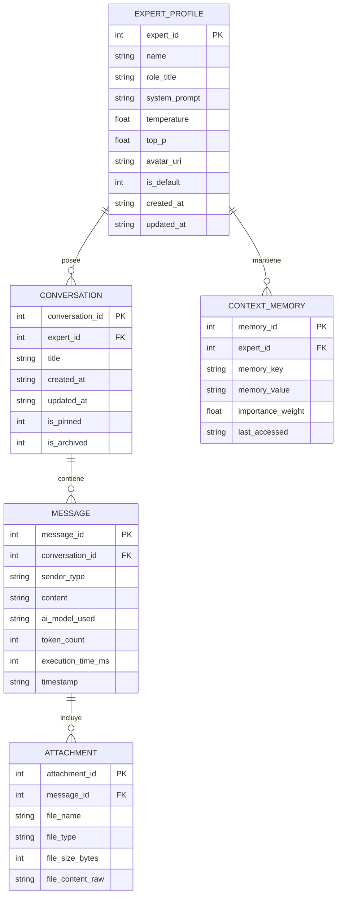

# MODELO ENTIDAD-RELACIÓN (MER) Y DICCIONARIO DE DATOS
**Proyecto:** Mask AI  
**Motor de Persistencia:** SQLite / Room Database v2.6  
**Motor Criptográfico:** SQLCipher AES-256  

---

## 1. Diagrama Entidad-Relación (MER Textual / Mermaid)

---

## 2. Diccionario de Datos Completo

### Tabla 1: `expert_profiles` (Máscaras de Expertos)
| Campo | Tipo de Dato | Nulo | Descripción y Restricciones |
| :--- | :--- | :---: | :--- |
| `expert_id` | INTEGER | NO | Clave Primaria Autoincremental. |
| `name` | TEXT (50) | NO | Nombre identificador del perfil experto (ej. "Senior Kotlin Dev"). |
| `role_title` | TEXT (100)| NO | Título o especialidad técnica asignada. |
| `system_prompt` | TEXT | NO | Prompt de sistema que condiciona las directivas del modelo. |
| `temperature` | REAL | NO | Hiperparámetro de creatividad (Rango: 0.0 - 1.0, Default: 0.7). |
| `top_p` | REAL | NO | Muestreo de núcleo Top-P (Rango: 0.1 - 1.0, Default: 0.9). |
| `avatar_uri` | TEXT | SÍ | Ruta del recurso gráfico o ícono del avatar. |
| `is_default` | INTEGER | NO | Indicador de perfil predeterminado (1=Sí, 0=No). |
| `created_at` | TEXT | NO | Timestamp ISO 8601 de creación del perfil. |

### Tabla 2: `conversations` (Hilos de Conversación)
| Campo | Tipo de Dato | Nulo | Descripción y Restricciones |
| :--- | :--- | :---: | :--- |
| `conversation_id` | INTEGER | NO | Clave Primaria Autoincremental. |
| `expert_id` | INTEGER | NO | Clave Foránea referenciando `expert_profiles(expert_id)` ON DELETE CASCADE. |
| `title` | TEXT (150)| NO | Título descriptivo generado o editado por el usuario. |
| `created_at` | TEXT | NO | Timestamp ISO 8601 de inicio de conversación. |
| `is_pinned` | INTEGER | NO | Bandera de fijado superior en lista (1=Fijado, 0=Normal). |

### Tabla 3: `messages` (Mensajes Intercambiados)
| Campo | Tipo de Dato | Nulo | Descripción y Restricciones |
| :--- | :--- | :---: | :--- |
| `message_id` | INTEGER | NO | Clave Primaria Autoincremental. |
| `conversation_id` | INTEGER | NO | Clave Foránea referenciando `conversations(conversation_id)` ON DELETE CASCADE. |
| `sender_type` | TEXT (10) | NO | Emisor del mensaje ('USER', 'ASSISTANT', 'SYSTEM'). |
| `content` | TEXT | NO | Cuerpo del mensaje en texto plano o Markdown. |
| `ai_model_used` | TEXT (50) | NO | Identificador del modelo (ej. 'local-phi3-int4', 'gpt-4o', 'claude-3-5'). |
| `token_count` | INTEGER | SÍ | Número total de tokens procesados en el mensaje. |
| `execution_time_ms`| INTEGER | SÍ | Tiempo total de respuesta en milisegundos. |
| `timestamp` | TEXT | NO | Timestamp ISO 8601 del envío. |
